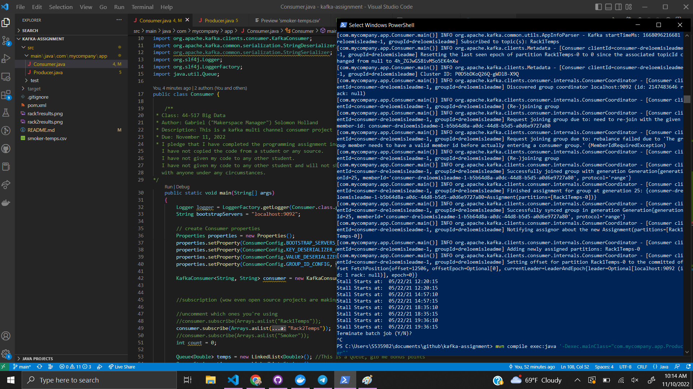
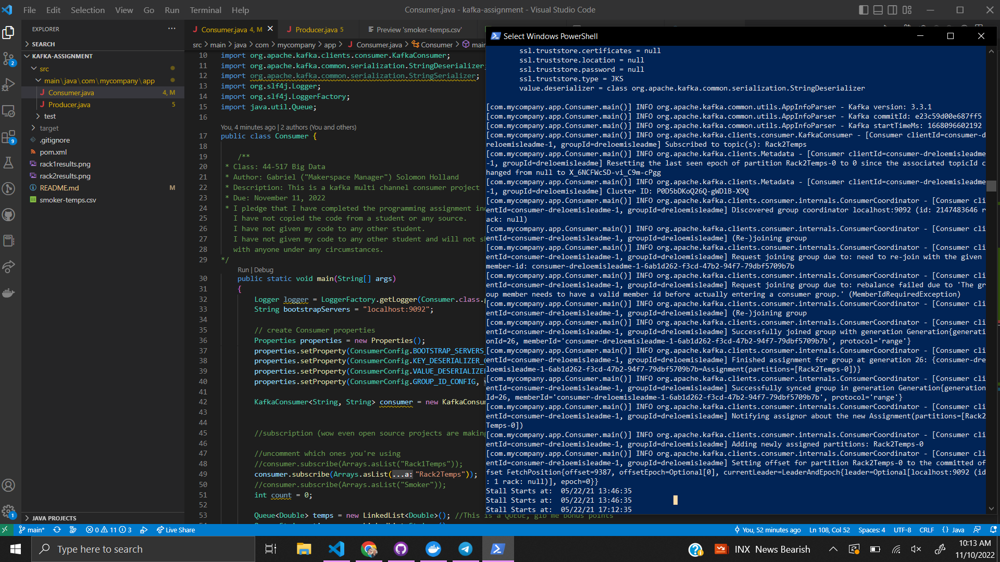

# Kafka Project
This maven based java project contains the dependencies for using the Kafka Clients.

To run the Producer from a terminal, run

```powershell
mvn compile exec:java '-Dexec.mainClass="com.mycompany.app.Producer"'
```

To run your Conusmer from a terminal, run

```powershell
mvn compile exec:java '-Dexec.mainClass="com.mycompany.app.Consumer"'
```

You should also be able to open this project in Netbeans, IntelliJ, or Eclipse; you are responsible for knowing how to run your own code.

## Project Requirements

### Create Topic (or Topics)

There are two different ways to go about this project.
We can:

* Use a separate topic for each channel of data
* Use a single topic for all temperature and specify our behavior with keys

The Producer class has code for both options; uncomment the approch you prefer to take.
Create either one topic or three topics and modify the appropriate lines of code in the `Producer.java` file.
The topics and keys you create must make sense; do not just accept the default names for things or use the quickstart.

Familiarize yourself with the Producer and the headers in the included CSV file to determine what appropriate names for topics or keys would be.
Do note that normally this would be a live stream of data instead of feeding information in directly from the CSV; we are using the producer to simulate what would be live streaming data.

### Write the Consumer(s)

One Consumer file has been created for you, but you may write multiple consumers.
You want to build a consumer that will read from either the multiple topics or single topics with multiple keys because we want to analyze each temperature channel differently.

Here is what we know about the data coming in:

When running a barbeque smoker, an accomplished (or even novice) pitmaster will closely monitor the temperatures of the cooking implement and the food to ensure everything is tasty. Often on long cooks, the following (less than favorable) events can happen:

* The temperature of the smoker can suddenly drop.
* The food hits a temperature where it is attempting to evaporate moisture, and it stays close to this temperature for an extended period of time (much like humans sweat to regulate temperature). We call this the "stall". The food will only hit its stall *once*

Modern technology has graced us with thermometers that allow us to track and record temperatures and keep a history of the temperatures of both the smoker and the food over time. We will be working with a data set generated from a thermometer that records the temperature *every thirty seconds*. The particular meal involved two different channels of data for food and the temperature of the smoker. We will be looking at sliding windows of data to detect the events described above. Specifically:

* If the temperature of the smoker drops more than 15 degrees in 2.5 minutes, we want to alert the pitmaster that the smoker needs attention
* If the temperature of the food does not change by more than one degree over a 10 minute time period, we want to report that the food has hit the stall

Write one or more consumers (depending on how you set up your producer with topics and keys) that will answer the following questions:

1. What times did the smoker need attention?
1. What time did the food on channel 1 hit its stall?
2. What time did the food on channel 2 hit its stall?

You should use a sliding window approach to analyze our data.
*You can receive one bonus point if you write your consumers so they do not store all historical data AND you use an appropriate data structure for the task*

### Coding Standards

Your Consumer code must:

* Be formatted cleanly and consistently
* Use good variable names and follow good coding standards
* Contain the following header with the appropriate information (indicated in `()`) filled in:

```java
/**
 * Class: 44-517 Big Data
 * Author: (Your name)
 * Description: (Brief description of the project)
 * Due: (Due date)
 * I pledge that I have completed the programming assignment independently.
   I have not copied the code from a student or any source.
   I have not given my code to any other student.
   I have not given my code to any other student and will not share this code
   with anyone under any circumstances.
*/
```

### Questions and submission instructions

Submit to the course website a document (docx or pdf) with the following:

1. Answers to the following questions:
    1. What times did the smoker need attention? Make sure to list ALL the times!
       1. Give attention at: 05/22/21 20:16:45
       2. Give attention at: 05/22/21 20:17:40
       3. Give attention at: 05/22/21 20:17:45
       4. Give attention at: 05/22/21 20:18:40
       5. Give attention at: 05/22/21 20:18:45
       6. Give attention at: 05/22/21 20:19:40
       7. Give attention at: 05/22/21 20:19:45
    2. What time did the food on channel 1 hit its stall?
       1. Stall Starts at:  05/22/21 14:57:10
    3. What time did the food on channel 2 hit its stall?
       1. Stall Starts at:  05/22/21 17:12:35
    4. Do you think other windowing approaches or considering the entire temperature history would be more appropriate for the questions we are trying to answer?  Why or why not?
    5. No, the way we have it is working fine. Our producer properly reads the windows, no need to change what isn't broken
2. Screenshots of your code running *on your computer* showing the output that you generated.  Your screenshots must have some kind of indication that it is you running the code.
   1. 
   2. 

Print your consumer code to PDF and submit it as a separate document.
Visual Studio Code has an extension called `PrintCode` that will let you print from VS Code easily.


